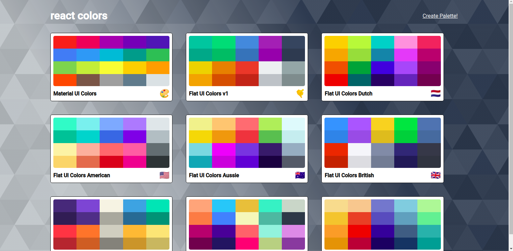
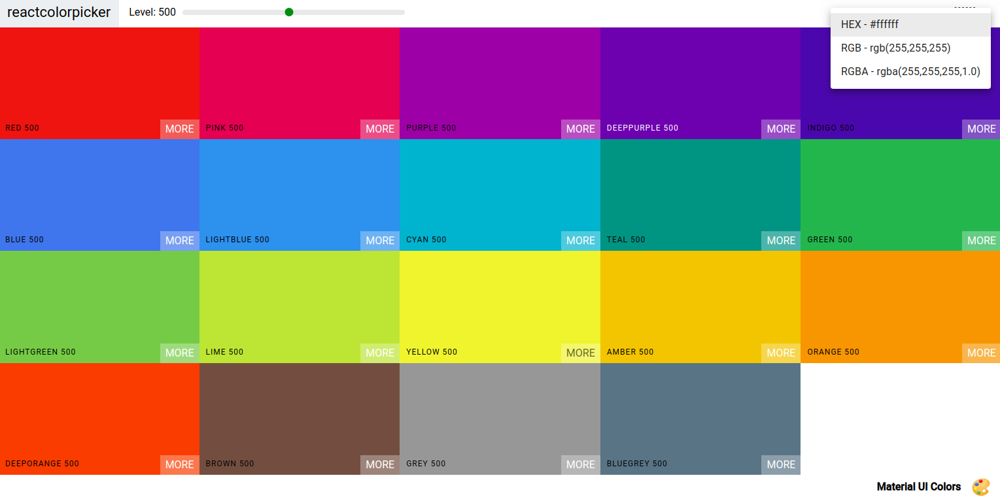
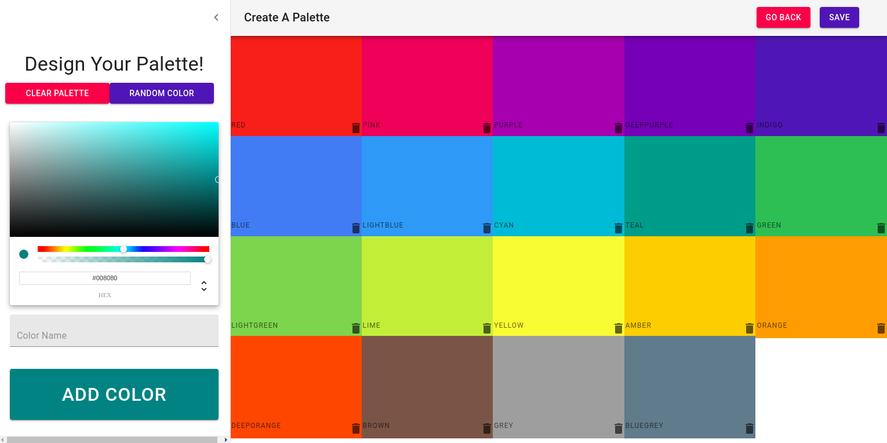

This is my first ever fully functioning React Application. It models websites such as Material UI Colors and Flat UI Colors!
---------------------------

This website helped me learn a ton of key React concepts where I was able to work on a project with common state patterns, routing, working with many different libraries and tools, DOM events, as well as key design patterns. This propelled me to move onto Node, Express, and MongoDB to complete a basic understanding of the MERN stack as well as work on other React projects!

Check out the project to interact with it!

https://soccerbart.github.io/colors/

---------------------------

---------------------------

---------------------------
